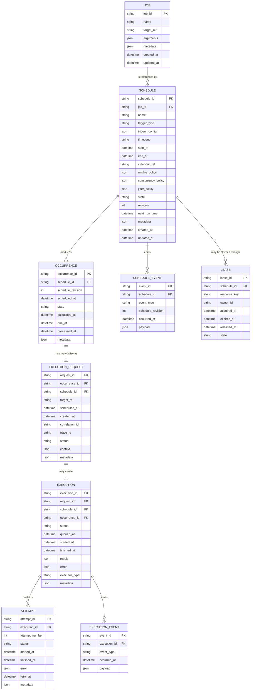
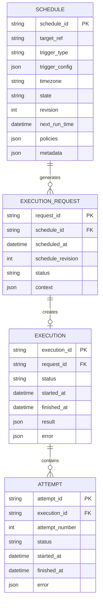
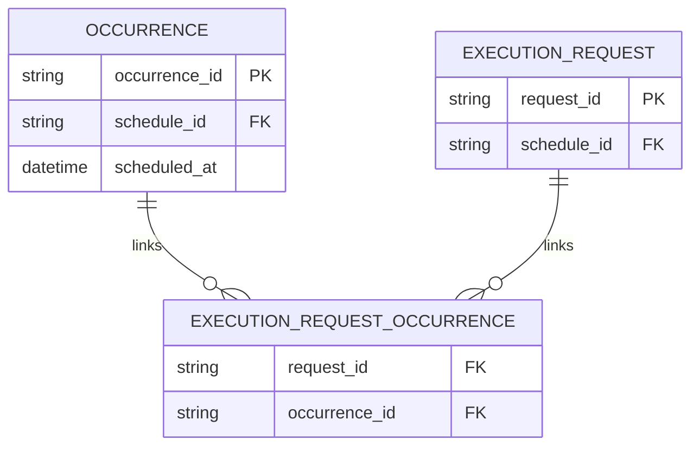

# PyScheduleKit — Entity Relationship Diagram

**Document :** `07_SCHEDULING_ERD.md`  
**Projet :** PyScheduleKit  
**Nature :** ERD / Modèle relationnel conceptuel  
**Statut :** Modèle de référence initial  
**Documents liés :**
- `03_SCHEDULING_DOMAIN_VOCABULARY.md`
- `04_SCHEDULING_BUSINESS_OBJECTS.md`
- `05_SCHEDULING_ENTITIES_AND_VALUE_OBJECTS.md`
- `06_SCHEDULING_DOMAIN_MODEL.md`

---

# 1. Objectif

Ce document traduit le modèle métier du scheduling en une représentation relationnelle conceptuelle.

L'objectif n'est pas encore de définir :

```text
PostgreSQL
SQLite
SQLAlchemy
DDL
indexes
migrations
```

mais de répondre à :

> **Quelles informations doivent être persistées, quelles relations existent entre elles, et quelles données doivent rester des Value Objects embarqués plutôt que devenir des entités relationnelles autonomes ?**

L'ERD doit préserver le modèle métier défini précédemment.

---

# 2. Principe directeur

Le modèle relationnel ne doit pas dicter le modèle métier.

La direction reste :

```text
DOMAIN MODEL
     │
     ▼
PERSISTENCE MODEL
```

et non :

```text
DATABASE TABLES
     │
     ▼
DOMAIN MODEL
```

Une table SQL n'est pas automatiquement une Entity DDD.

Inversement, tous les Value Objects ne doivent pas devenir des tables.

---

# 3. Vue générale

Le cœur persistant envisagé est :

```text
Job
 │
 │ 1:N
 ▼
Schedule
 │
 │ 1:N logique
 ▼
Occurrence
 │
 │ 0..1
 ▼
ExecutionRequest
 │
 │ 0..1
 ▼
Execution
 │
 │ 1:N
 ▼
Attempt
```

Autour de cette chaîne :

```text
Lease
ScheduleEvent
ExecutionEvent
```

peuvent fournir :

```text
coordination distribuée
audit
observabilité
recovery
```

---

# 4. ERD principal — Mermaid



---

# 5. Chaîne métier représentée

L'ERD traduit cette chaîne :

```text
Job
 ↓
Schedule
 ↓
Occurrence
 ↓
ExecutionRequest
 ↓
Execution
 ↓
Attempt
```

Chaque objet répond à une question différente.

```text
Job
→ Quoi exécuter ?

Schedule
→ Quand et selon quelles politiques ?

Occurrence
→ Quelle échéance précise ?

ExecutionRequest
→ Quelle demande doit être soumise ?

Execution
→ Quel run concret existe ?

Attempt
→ Quelle tentative est en cours ?
```

---

# 6. JOB

## Rôle

`JOB` représente une définition logique réutilisable d'un travail.

Exemple :

```text
generate_daily_report
```

Un même job peut être associé à plusieurs schedules.

---

## Relation

```text
JOB 1
 │
 │
 └──────── N SCHEDULE
```

Exemple :

```text
Job:
generate_report

Schedule #1:
08:00 Europe/Paris

Schedule #2:
08:00 America/New_York
```

---

# 7. Faut-il réellement persister JOB ?

Cette table est **optionnelle**.

Deux architectures restent possibles.

## Modèle A — Job explicite

```text
JOB
 ↓
SCHEDULE
```

Avantages :

```text
réutilisation
identité du travail
configuration centralisée
```

---

## Modèle B — Target directement dans Schedule

```text
SCHEDULE
 └── target_ref
```

Avantages :

```text
modèle plus simple
moins d'entités
faible couplage
```

Pour une première version légère de PyScheduleKit, le modèle B pourrait suffire.

L'ERD conserve néanmoins `JOB` afin de représenter le modèle métier complet.

---

# 8. SCHEDULE

`SCHEDULE` est l'entité centrale.

Il correspond à l'Aggregate Root principal.

Il contient :

```text
identité
target/job
trigger
timezone
fenêtre temporelle
policies
state
revision
next_run_time
```

---

# 9. Trigger dans Schedule

Le Trigger ne devient pas nécessairement une table.

On peut stocker :

```text
trigger_type
trigger_config
```

Exemple :

```json
{
  "type": "cron",
  "expression": "0 6 * * *"
}
```

ou :

```json
{
  "type": "interval",
  "seconds": 300
}
```

Cela respecte le fait que :

```text
Trigger
=
Value Object
```

---

# 10. Pourquoi ne pas créer une table TRIGGER ?

Un modèle comme :

```text
TRIGGER
trigger_id
...
```

introduirait une identité artificielle.

Or :

```text
CronTrigger("0 6 * * *")
```

est défini par sa valeur.

Le Trigger n'a donc pas besoin d'exister indépendamment du Schedule.

---

# 11. Politiques dans Schedule

Même principe pour :

```text
MisfirePolicy
ConcurrencyPolicy
JitterPolicy
```

Elles peuvent être persistées sous forme :

```text
type + configuration
```

Exemple :

```json
{
  "type": "catch_up",
  "max_occurrences": 10
}
```

---

# 12. TIMEZONE

Une timezone peut être stockée comme :

```text
Europe/Paris
```

dans :

```text
schedule.timezone
```

Elle reste un Value Object dans le domaine.

Il n'est pas nécessaire de créer :

```text
TIMEZONE
timezone_id
```

sauf besoin fonctionnel externe.

---

# 13. CALENDAR

Deux stratégies sont possibles.

## Calendar embarqué

Pour un calendrier simple :

```text
weekdays
excluded dates
allowed hours
```

on peut utiliser :

```text
calendar_config JSON
```

---

## Calendar référencé

Pour un calendrier partagé :

```text
FrenchBankingCalendar
CompanyCalendar
MarketCalendar
```

on peut utiliser :

```text
calendar_ref
```

vers un bounded context ou repository spécialisé.

---

# 14. NEXT_RUN_TIME

`next_run_time` est intéressant.

Conceptuellement, il est dérivable :

```text
Trigger
+
Previous Occurrence
=
NextRunTime
```

Mais dans un scheduler opérationnel, le persister peut être très utile.

---

# 15. Pourquoi persister next_run_time ?

Pour éviter :

```text
recalcul complet de tous les schedules
```

à chaque tick.

Le scheduler peut demander :

```sql
WHERE next_run_time <= now
```

Cela permet une sélection efficace.

---

# 16. next_run_time reste néanmoins dérivé

Il faut conserver l'idée :

```text
Trigger
=
source de vérité logique

next_run_time
=
état opérationnel dérivé
```

Le champ peut être reconstruit.

---

# 17. OCCURRENCE

Dans les documents précédents, `Occurrence` était proposée initialement comme Value Object.

Pourquoi existe-t-elle ici comme table ?

Parce qu'un système durable ou distribué peut souhaiter **matérialiser** certaines occurrences.

Il faudrait alors parler plus précisément de :

```text
MATERIALIZED_OCCURRENCE
```

---

# 18. Option minimaliste

Dans une première implémentation locale, on peut totalement supprimer la table :

```text
OCCURRENCE
```

et utiliser une identité naturelle :

```text
(schedule_id, scheduled_at, revision)
```

directement dans `ExecutionRequest`.

---

# 19. Option durable

Pour :

```text
audit
catch-up
deduplication
distributed scheduling
recovery
```

la matérialisation devient utile.

On obtient alors :

```text
Schedule
   ↓
MaterializedOccurrence
```

---

# 20. Clé naturelle d'une occurrence

Une contrainte importante peut être :

```text
UNIQUE(
    schedule_id,
    scheduled_at,
    schedule_revision
)
```

Cela évite de matérialiser deux fois la même occurrence logique.

---

# 21. Pourquoi inclure schedule_revision ?

Supposons :

```text
revision 1
06:00
```

puis :

```text
revision 2
08:00
```

Une occurrence doit rester reliée à la définition temporelle qui l'a produite.

Ainsi :

```text
schedule_revision
```

fait partie de son identité historique.

---

# 22. État d'une occurrence

Valeurs possibles :

```text
PLANNED
DUE
MISSED
SKIPPED
MATERIALIZED
COALESCED
```

Mais il faudra probablement réduire ce nombre.

L'ERD ne doit pas forcer prématurément une machine à états complexe.

---

# 23. EXECUTION_REQUEST

`EXECUTION_REQUEST` constitue la frontière entre :

```text
Scheduling
```

et :

```text
Execution Runtime
```

---

# 24. Relation Occurrence → ExecutionRequest

Dans le modèle nominal :

```text
Occurrence
   │
   └── 0..1 ExecutionRequest
```

Pourquoi `0` ?

Parce qu'une occurrence peut être :

```text
skipped
missed
coalesced
cancelled
```

sans produire d'exécution.

---

# 25. Déduplication de la demande

Une contrainte peut être :

```text
UNIQUE(occurrence_id)
```

si :

```text
1 occurrence
→ maximum 1 ExecutionRequest
```

est un invariant du modèle.

---

# 26. EXECUTION

Une `Execution` représente le run concret.

Relation :

```text
ExecutionRequest
     │
     └── 0..1 Execution
```

Une demande peut être rejetée avant qu'une execution soit créée.

---

# 27. Pourquoi séparer Request et Execution ?

Considérons :

```text
ExecutionRequest created
        ↓
Queue unavailable
        ↓
submission failed
```

Aucune execution réelle n'a commencé.

Si les deux concepts sont fusionnés, on perd cette distinction.

---

# 28. EXECUTION status

Valeurs potentielles :

```text
CREATED
QUEUED
RUNNING
SUCCESS
FAILED
CANCELLED
TIMED_OUT
REJECTED
```

Mais :

```text
REJECTED
```

peut éventuellement appartenir à `ExecutionRequest` plutôt qu'à `Execution`.

Le modèle final devra rester cohérent.

---

# 29. Timestamps

Il est important de ne pas fusionner :

```text
scheduled_at
triggered_at
queued_at
started_at
finished_at
```

Exemple :

```text
scheduled_at = 06:00:00
request      = 06:00:01
queued_at    = 06:00:02
started_at   = 06:00:08
finished_at  = 06:04:51
```

Chaque instant décrit un phénomène différent.

---

# 30. ATTEMPT

Une execution peut comporter plusieurs tentatives.

```text
Execution #E1
   │
   ├── Attempt #1 FAILED
   ├── Attempt #2 FAILED
   └── Attempt #3 SUCCESS
```

Relation :

```text
EXECUTION 1
    │
    └──── N ATTEMPT
```

---

# 31. Contrainte d'Attempt

Un invariant relationnel utile :

```text
UNIQUE(
    execution_id,
    attempt_number
)
```

---

# 32. ATTEMPT status

Exemples :

```text
PENDING
RUNNING
SUCCESS
FAILED
CANCELLED
TIMED_OUT
```

---

# 33. Retry versus nouvelle occurrence

L'ERD rend visible cette distinction :

```text
SCHEDULE
   ↓
OCCURRENCE #1
   ↓
EXECUTION
   ├── ATTEMPT #1
   ├── ATTEMPT #2
   └── ATTEMPT #3
```

puis :

```text
OCCURRENCE #2
   ↓
EXECUTION
```

Ainsi :

```text
Retry
≠
Recurrence
```

---

# 34. LEASE

`LEASE` intervient dans un déploiement distribué.

Exemple :

```text
Schedule A
   │
   ▼
Lease
owner = scheduler-node-2
expires_at = ...
```

---

# 35. Pourquoi relier Lease à Schedule ?

Une stratégie simple consiste à prendre possession du :

```text
Schedule
```

pendant son évaluation.

Mais d'autres stratégies peuvent porter la lease sur :

```text
OccurrenceKey
```

ce qui peut être plus précis.

---

# 36. Alternative préférable pour le distribué

Une future version pourrait remplacer :

```text
schedule_id
```

par :

```text
resource_key
```

générique.

Exemple :

```text
schedule:daily-orders:2026-10-04T06:00
```

Cela permet de leaser une occurrence plutôt que le schedule entier.

---

# 37. Lease lifecycle

```text
ACTIVE
   │
   ├── renewed
   │
   ├── released
   │
   └── expired
```

Une lease ne doit jamais être permanente.

---

# 38. SCHEDULE_EVENT

Un journal d'événements peut conserver :

```text
ScheduleCreated
ScheduleActivated
SchedulePaused
ScheduleResumed
ScheduleRescheduled
ScheduleCancelled
```

---

# 39. Pourquoi conserver schedule_revision ?

Chaque événement peut préciser :

```text
revision
```

afin de reconstruire :

```text
quelle configuration était active
```

à un instant donné.

---

# 40. EXECUTION_EVENT

Exemples :

```text
ExecutionRequested
ExecutionQueued
ExecutionStarted
ExecutionSucceeded
ExecutionFailed
ExecutionCancelled
```

Ce journal peut servir à :

```text
audit
observability
timeline
debug
```

---

# 41. Events ≠ Event Sourcing obligatoire

La présence de :

```text
SCHEDULE_EVENT
EXECUTION_EVENT
```

ne signifie pas que PyScheduleKit doit être event-sourced.

On peut avoir :

```text
current state tables
+
append-only audit events
```

sans reconstruire les aggregates à partir des events.

---

# 42. Version simplifiée recommandée

Pour une première implémentation, un schéma beaucoup plus léger peut suffire.



---

# 43. Version minimale

Encore plus minimalement :

```text
SCHEDULE
+
EXECUTION
```

peut suffire pour apprendre les premières mécaniques.

Mais cela masque les distinctions :

```text
Occurrence
ExecutionRequest
Attempt
```

qui sont pédagogiquement importantes.

---

# 44. Recommandation de progression

Je recommande trois niveaux.

## Phase 1 — Learning model

```text
Schedule
Occurrence
Execution
```

---

## Phase 2 — Correct runtime model

```text
Schedule
Occurrence
ExecutionRequest
Execution
Attempt
```

---

## Phase 3 — Distributed durability

```text
Schedule
Occurrence
ExecutionRequest
Execution
Attempt
Lease
Events
```

Ainsi la complexité est introduite progressivement.

---

# 45. Cardinalités de référence

| Relation | Cardinalité |
|---|---|
| Job → Schedule | `1:N` |
| Schedule → Occurrence | `1:N` |
| Occurrence → ExecutionRequest | `1:0..1` |
| ExecutionRequest → Execution | `1:0..1` |
| Execution → Attempt | `1:N` |
| Schedule → ScheduleEvent | `1:N` |
| Execution → ExecutionEvent | `1:N` |
| Schedule/Occurrence → Lease | `1:N historique` |

---

# 46. Pourquoi Schedule → Occurrence est 1:N

Un schedule récurrent peut produire :

```text
Occurrence #1
Occurrence #2
Occurrence #3
...
```

Même un `DateTrigger` produit :

```text
0..1
```

occurrence.

---

# 47. Pourquoi Occurrence → Request n'est pas forcément 1:1

Une occurrence peut être :

```text
SKIPPED
```

sans request.

Elle peut aussi être :

```text
COALESCED
```

dans une autre demande.

Le modèle physique doit donc laisser cette relation optionnelle.

---

# 48. Coalescing et ERD

Le coalescing rend le modèle plus complexe.

Supposons :

```text
Occurrence A
Occurrence B
Occurrence C
      │
      └────→ ExecutionRequest X
```

La relation devient :

```text
N Occurrences
→ 1 Request
```

Le modèle actuel `occurrence_id` unique ne suffit plus.

---

# 49. Table d'association possible

Pour supporter proprement le coalescing :

```text
EXECUTION_REQUEST_OCCURRENCE
```

peut être introduite.



Ainsi :

```text
N occurrences
↔
N requests
```

sont techniquement possibles.

---

# 50. Recommandation pour la première version

Ne pas introduire immédiatement cette table.

Commencer par :

```text
1 Occurrence
→ 0..1 Request
```

et ajouter le modèle N:N lorsque le coalescing multi-occurrence sera réellement implémenté.

---

# 51. Catch-up

Le catch-up ne nécessite pas de relation particulière.

Il produit simplement plusieurs occurrences :

```text
Occurrence 08:00
Occurrence 09:00
Occurrence 10:00
```

qui génèrent chacune leur demande.

---

# 52. Fixed Delay

Un `FixedDelayTrigger` pose une particularité.

La prochaine occurrence dépend potentiellement de :

```text
previous execution finished_at
```

Cela crée une dépendance :

```text
Trigger
←
Execution state
```

plus forte qu'un trigger classique.

---

# 53. Conséquence architecturale

Il pourrait être préférable de distinguer :

```text
Calendar / FixedRate Trigger
```

de :

```text
Completion-relative Scheduling
```

car le second n'est plus purement fonction de la timeline.

Ce point devra être approfondi dans le document consacré aux triggers.

---

# 54. Audit du Schedule

Le Schedule peut contenir :

```text
created_at
updated_at
revision
```

La révision est particulièrement importante pour le contrôle concurrent.

---

# 55. Optimistic locking

Une future implémentation SQL pourrait utiliser :

```text
revision
```

comme version d'optimistic locking.

Conceptuellement :

```text
UPDATE schedules
SET ...
WHERE schedule_id = ?
AND revision = ?
```

Cela évite certaines modifications concurrentes silencieuses.

---

# 56. Contraintes relationnelles importantes

Quelques contraintes candidates :

```text
schedule_id NOT NULL

trigger_type NOT NULL

timezone NOT NULL

revision >= 1

attempt_number >= 1

started_at <= finished_at

start_at <= end_at

expires_at >= acquired_at
```

---

# 57. Contraintes d'unicité candidates

```text
UNIQUE(schedule_id, scheduled_at, revision)
```

pour les occurrences.

```text
UNIQUE(execution_id, attempt_number)
```

pour les attempts.

Éventuellement :

```text
UNIQUE(occurrence_id)
```

dans `ExecutionRequest`.

---

# 58. Indexes conceptuellement importants

Sans entrer encore dans l'implémentation physique :

```text
Schedule.next_run_time
Occurrence.schedule_id + scheduled_at
Execution.status
Execution.schedule_id
Attempt.execution_id
Lease.resource_key + expires_at
```

seront des clés importantes pour les accès runtime.

---

# 59. Requête centrale du scheduler

Conceptuellement :

```text
Find schedules where:

state = ACTIVE

AND next_run_time <= now
```

Cette requête explique l'importance opérationnelle de :

```text
next_run_time
```

---

# 60. Requête de concurrence

Pour `ForbidOverlap`, on peut avoir besoin de déterminer :

```text
Existe-t-il une Execution active
pour cette ConcurrencyKey ?
```

Le modèle peut donc nécessiter :

```text
concurrency_key
```

dans `Execution`.

---

# 61. Extension possible

```text
EXECUTION
──────────────────
concurrency_key
```

permettrait :

```text
WHERE
concurrency_key = ?
AND status IN ('QUEUED', 'RUNNING')
```

---

# 62. Multi-tenancy

Si PyScheduleKit doit devenir multi-tenant, une future clé :

```text
tenant_id
```

pourrait apparaître dans :

```text
Schedule
ExecutionRequest
Execution
```

Mais elle ne doit pas être introduite tant que le besoin n'est pas confirmé.

---

# 63. Soft delete

Pour les schedules, deux modèles sont possibles :

```text
DELETE
```

ou :

```text
state = CANCELLED
```

avec conservation historique.

La seconde approche est généralement préférable pour un système auditable.

---

# 64. Schedule deletion versus cancellation

Il faut distinguer :

```text
Cancel Schedule
```

de :

```text
Delete persistence record
```

La première est métier.

La seconde est administrative.

---

# 65. Historique des exécutions

Il ne doit jamais être embarqué dans la ligne Schedule.

Éviter :

```text
schedule.execution_history = JSON(...)
```

Les executions sont un ensemble autonome potentiellement massif.

---

# 66. Séparation des volumes

Ordre de grandeur possible :

```text
100 schedules

mais

10 000 000 executions
```

Cela confirme que :

```text
Schedule
```

et :

```text
Execution
```

doivent être séparés.

---

# 67. Purge et rétention

Les schedules peuvent avoir une durée de vie longue.

Les executions et events peuvent avoir une politique de rétention.

Exemple :

```text
Executions:
retain 90 days

Events:
retain 1 year
```

Cette politique appartient à l'infrastructure/opérationnel, pas au Schedule.

---

# 68. Integration avec PyWorkflowKit

Une `ExecutionRequest` peut contenir :

```text
target_ref = "workflow:daily_orders"
```

L'adapter :

```text
WorkflowExecutor
```

traduit ensuite vers PyWorkflowKit.

L'ERD de PyScheduleKit ne doit pas inclure :

```text
WORKFLOW
STEP
DEPENDENCY
```

---

# 69. Integration avec PyIngestKit

Même logique :

```text
target_ref = "ingestion:orders"
```

PyIngestKit conserve son propre :

```text
IngestionRun
```

---

# 70. Integration avec PyTransformKit

```text
target_ref = "transform:clean-orders"
```

PyTransformKit conserve :

```text
TransformationRun
```

---

# 71. Correlation cross-framework

`ExecutionRequest` peut transporter :

```text
correlation_id
```

qui est propagé :

```text
PyScheduleKit
    │
    ▼
PyWorkflowKit
    │
    ▼
PyIngestKit
    │
    ▼
PyTransformKit
```

sans relation de base de données directe.

---

# 72. Pourquoi éviter les FK inter-frameworks

Éviter :

```text
pyschedule.execution
FK
pyworkflow.workflow_run
```

Cela créerait un couplage physique fort.

Préférer :

```text
external_ref
correlation_id
target_ref
```

---

# 73. Boundaries relationnelles

Ainsi :

```text
PyScheduleKit DB
────────────────────
Schedule
Occurrence
ExecutionRequest
Execution
Attempt

PyWorkflowKit DB
────────────────────
Workflow
WorkflowRun
StepRun

PyIngestKit DB
────────────────────
IngestionRun

PyTransformKit DB
────────────────────
TransformationRun
```

avec corrélation logique plutôt que FK physique.

---

# 74. Modèle de données conseillé à terme

```text
SCHEDULE
    │
    ├── Value Objects embedded
    │
    └── next_run_time
    │
    ▼
OCCURRENCE
    │
    ▼
EXECUTION_REQUEST
    │
    ▼
EXECUTION
    │
    ▼
ATTEMPT
```

plus :

```text
LEASE
EVENTS
```

pour les besoins avancés.

---

# 75. Modèle pédagogique

Pour comprendre le scheduling, il faut surtout retenir :

```text
Schedule
    │
    │ "voici la règle"
    ▼

Occurrence
    │
    │ "voici l'échéance"
    ▼

ExecutionRequest
    │
    │ "voici la décision"
    ▼

Execution
    │
    │ "voici ce qui s'est réellement produit"
    ▼

Attempt
       "voici les tentatives techniques"
```

---

# 76. Le temps traverse tout le modèle

```text
Schedule
next_run_time

Occurrence
scheduled_at

ExecutionRequest
created_at

Execution
started_at
finished_at

Attempt
started_at
finished_at

Lease
expires_at
```

Le domaine peut donc être considéré comme fortement temporel.

---

# 77. Plusieurs vérités temporelles

Il faut préserver :

```text
planned time
decision time
queue time
start time
completion time
```

qui ne sont pas interchangeables.

---

# 78. Diagramme temporel

```text
scheduled_at
     │
     ▼
  06:00:00
     │
     │ scheduler detects
     ▼
triggered_at
  06:00:02
     │
     │ dispatch
     ▼
queued_at
  06:00:03
     │
     │ worker available
     ▼
started_at
  06:00:08
     │
     │ execution
     ▼
finished_at
  06:04:32
```

---

# 79. Métriques dérivables

Le modèle permet de calculer :

```text
trigger lag
=
triggered_at - scheduled_at
```

```text
queue latency
=
started_at - queued_at
```

```text
execution duration
=
finished_at - started_at
```

```text
total scheduling latency
=
started_at - scheduled_at
```

---

# 80. Recovery

Après redémarrage :

```text
Schedule.next_run_time
Occurrence history
ExecutionRequest state
Execution state
```

peuvent permettre au système de reconstruire sa situation.

---

# 81. Exemple de recovery

```text
Schedule:
next_run_time = 08:00

Current time:
08:15

No occurrence exists
```

Le scheduler peut identifier :

```text
potential misfire
```

et appliquer :

```text
MisfirePolicy
```

---

# 82. Exemple avec occurrence persistée

```text
Occurrence:
08:00
state = DUE

No ExecutionRequest
```

Le système peut reprendre plus précisément :

```text
Occurrence
   ↓
evaluate
   ↓
ExecutionRequest
```

---

# 83. Trade-off

Persister les occurrences améliore :

```text
audit
recovery
distributed correctness
```

mais augmente :

```text
storage
complexity
write volume
```

Il faudra donc rendre cette matérialisation optionnelle ou ciblée.

---

# 84. ERD logique recommandé

Le modèle de référence complet reste :

```text
JOB
 │
 ▼
SCHEDULE
 │
 ▼
OCCURRENCE
 │
 ▼
EXECUTION_REQUEST
 │
 ▼
EXECUTION
 │
 ▼
ATTEMPT
```

avec :

```text
LEASE
EVENTS
```

comme extensions transverses.

---

# 85. ERD physique initial recommandé

Pour une première version du framework :

```text
SCHEDULE
EXECUTION_REQUEST
EXECUTION
ATTEMPT
```

avec occurrence représentée naturellement par :

```text
schedule_id
scheduled_at
schedule_revision
```

dans `EXECUTION_REQUEST`.

C'est probablement le meilleur compromis initial.

---

# 86. Modèle initial proposé

```mermaid
erDiagram

    SCHEDULE ||--o{ EXECUTION_REQUEST : generates
    EXECUTION_REQUEST ||--o| EXECUTION : produces
    EXECUTION ||--o{ ATTEMPT : contains

    SCHEDULE {
        string schedule_id PK
        string target_ref

        string trigger_type
        json trigger_config

        string timezone

        datetime start_at
        datetime end_at

        json policies

        string state
        int revision

        datetime next_run_time

        json metadata

        datetime created_at
        datetime updated_at
    }

    EXECUTION_REQUEST {
        string request_id PK

        string schedule_id FK
        int schedule_revision

        datetime scheduled_at
        datetime created_at

        string correlation_id
        string trace_id

        string status

        json context
        json metadata
    }

    EXECUTION {
        string execution_id PK
        string request_id FK

        string concurrency_key

        string status

        datetime queued_at
        datetime started_at
        datetime finished_at

        json result
        json error

        json metadata
    }

    ATTEMPT {
        string attempt_id PK
        string execution_id FK

        int attempt_number
        string status

        datetime started_at
        datetime finished_at
        datetime retry_at

        json error
    }
```



---

# 87. Pourquoi ce modèle est préférable pour commencer

Il préserve les distinctions essentielles :

```text
Schedule
ExecutionRequest
Execution
Attempt
```

tout en évitant immédiatement :

```text
Occurrence table
Lease table
Event sourcing
Job table
Calendar table
Policy tables
```

qui peuvent être ajoutées progressivement.

---

# 88. Évolution future

```text
V0
──────────────
Schedule
ExecutionRequest
Execution
Attempt

        ↓

V1
──────────────
+ MaterializedOccurrence
+ Lease

        ↓

V2
──────────────
+ ScheduleEvents
+ ExecutionEvents
+ distributed ownership

        ↓

V3
──────────────
+ advanced retention
+ partitioning
+ event integrations
```

---

# 89. Invariants ERD majeurs

```text
1.
Schedule possède une identité stable.

2.
Une occurrence logique dépend :
ScheduleId + ScheduledAt + Revision.

3.
Une ExecutionRequest référence toujours
l'intention temporelle qui l'a créée.

4.
Execution ≠ ExecutionRequest.

5.
Attempt ≠ Execution.

6.
Les Value Objects ne deviennent pas
des tables sans justification métier.

7.
L'historique des executions reste
séparé de l'Aggregate Schedule.

8.
Les autres Py*Kit ne sont pas liés
par des foreign keys physiques.
```

---

# 90. Modèle mental final

```text
                         SCHEDULE
                 "Quelle règle suivre ?"
                            │
                            │
                            ▼
                      OCCURRENCE
                 "Quelle échéance ?"
                            │
                            │
                            ▼
                  EXECUTION REQUEST
                  "Doit-on lancer ?"
                            │
                            │
                            ▼
                       EXECUTION
                 "Que s'est-il passé ?"
                            │
                            │
                            ▼
                        ATTEMPT
                  "Quelle tentative ?"
```

---

# Conclusion

L'ERD de PyScheduleKit doit refléter les distinctions du domaine au lieu de les écraser dans une table générique `jobs`.

Le modèle conceptuel complet est :

```text
Job
→ Schedule
→ Occurrence
→ ExecutionRequest
→ Execution
→ Attempt
```

mais la première implémentation peut raisonnablement commencer par :

```text
Schedule
→ ExecutionRequest
→ Execution
→ Attempt
```

avec :

```text
OccurrenceKey
=
ScheduleId
+
ScheduledAt
+
ScheduleRevision
```

comme identité naturelle de l'occurrence.

Cette architecture conserve un modèle simple tout en laissant une trajectoire claire vers :

```text
misfire durable
catch-up
coalescing
distributed scheduling
leases
deduplication
audit
observability
```

sans surcharger le framework dès sa première version.

---

# Suite documentaire

Après cet ERD, la suite naturelle reste :

```text
08_TIME_CLOCK_TIMEZONE_AND_CALENDAR_MODEL.md
```

Ce document devra approfondir le sous-domaine probablement le plus fondamental de PyScheduleKit :

```text
Instant
LocalDateTime
Clock
Wall Clock
Monotonic Clock
Duration
Timezone
DST
Calendar
Business Calendar
TimeWindow
Deadline
GracePeriod
```

avant de revenir ensuite au modèle détaillé de `Job`, `Schedule` et `Trigger`.